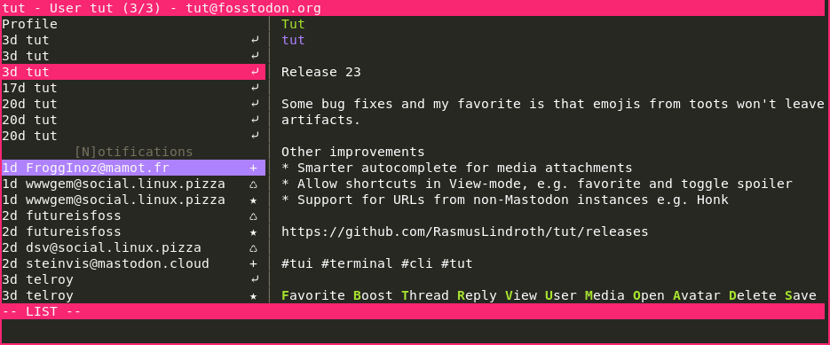

# Tut - a Mastodon TUI

A TUI for Mastodon with vim inspired keys. The program has most of the 
features you can find in the web client. 

Press `C` to create a new toot and `N` to focus on your notifications.

You can find Linux binaries under [releases](https://github.com/RasmusLindroth/tut/releases).




## Table of contents
* [Currently supported commands](#currently-supported-commands)
* [Configuration](#configuration)
* [Install instructions](#install-instructions)
  * [Binary releases](#binary-releases)
  * [Arch and Manjaro](#arch-and-manjaro)
  * [Alpine Linux](#alpine-linux)
  * [Debian](#debian)
  * [FreeBSD](#freebsd)
* [Build it yourself](#build-it-yourself)
* [Flags and commands](#flags-and-commands)
* [Templates](#templates)
* [Password manager for secrets](#password-manager-for-secrets)
* [Thanks to](#thanks-to)

## Currently supported commands
* `:q` `:quit` exit
* `:timeline` home, local, federated, direct, notifications, favorited
  * `:tl` h, l, f, d, n, fav (shorter form)
* `:blocking` lists users that you have blocked
* `:boosts` lists users that boosted the toot
* `:bookmarks` lists all your bookmarks
* `:compose` compose a new toot
* `:favorited` lists toots you've favorited
* `:favorites` lists users that favorited the toot
* `:h` `:help` view help 
* `:lists` show a list of your lists
* `:list-placement` top, right, bottom, left
* `:list-split` row, column
* `:muting`  lists users that you have muted
* `:preferences` update your profile and some other settings
* `:profile` go to your profile
* `:proportions` [int] [int], where the first integer is the list and the other content, e.g. `:proportions 1 3`
* `:requests` see following requests
* `:saved` alias for bookmarks
* `:tag` followed by the hashtag e.g. `:tag linux`
* `:user` followed by a username e.g. `:user rasmus` to narrow a search include 
* `:window` switch window by index (zero indexed) e.g. `:window 0` for the first window.

Keys without description in tut
* `c` = Compose a new toot
* `jk` = navigation up and down in feed
* `hl` = cycle through feeds without closing them as you do with `q` and `ESC`
* `arrow keys` = navigation. Same as `jk` and `hl`
* `g` or `Home` = go to top
* `G` or `End` = go to bottom
* `?` = view help
* `q` = go back and quit
* `ESC` = go back

Explanation of the non obvious keys when viewing a toot
* `V` = view. In this mode you can scroll throught the text of the toot if it doesn't fit the screen
* `O` = open. Gives you a list of all URLs in the toot. Opens them in your default browser, if it's
an user or tag they will be opened in tut.
* `M` = media. Opens the media with `xdg-open`.

## Configuration
Tut is configurable, so you can change things like the colors, the default timeline, 
what image viewer to use and some more. Check out the configuration file to see 
all the options.

You find it in `XDG_CONFIG_HOME/tut/config.ini` which usally equals to `~/.config/tut/config.ini`.

You can find an updated configuration file in this repo named `config.example.ini`.
If there are any new configurations options you can copy them frome that file.

## Install instructions
### Binary releases
Head over to https://github.com/RasmusLindroth/tut/releases

### Arch and Manjaro

You can find it in the Arch User Repository (AUR). I'm the maintainer there.

https://aur.archlinux.org/packages/tut/

You can also use `tut-mastodon`. Currently `aur/tut` collides with a package 
named `tut` if you're running Manjaro ARM. So if you face the same problem you 
can use this package instead. I suggest you add an alias for tut-mastodon to
tut in the config for your shell. Usually `.bashrc` or `.zshrc`.

`alias tut='tut-mastodon'`

https://aur.archlinux.org/packages/tut-mastodon/

### Alpine Linux

`tut` package is available in the community repository.

https://pkgs.alpinelinux.org/package/edge/community/x86_64/tut

### Debian

http://packages.azlux.fr/ (I'm not the maintainer)

### FreeBSD

https://www.freshports.org/net-im/tut (I'm not the maintainer)


## Build it yourself
If you don't use the binary that you find under releases
you will need Go. Use a newer one that supports modules.

```bash
# Fetches and installs tut. Usally /home/user/go/bin
go get -u github.com/RasmusLindroth/tut

# You can also clone the repo if you like
# First clone this repository
git clone https://github.com/RasmusLindroth/tut.git

# Go to that folder
cd tut

# Build or install

# Install (usally /home/user/go/bin)
go install

# Build (same directory i.e. ./ )
go build
```

If you choose to install and want to be able to just run `tut` 
you will have to add `go/bin` to your `$PATH`.

## Flags and commands
```
Commands:
    example-config - creates the default configuration file in the current directory and names it ./config.example.ini

Flags:
    --help -h - prints this message
    --version -v - prints the version
    --new-user -n - add one more user to tut
    --user <name> -u <name> - login directly to user named <name>
        Don't use a = between --user and the <name> 
        If two users are named the same. Use full name like tut@fosstodon.org
```

## Templates
You can customise how toots and user profiles are displayed with a
Go [text/template](https://pkg.go.dev/text/template).

You'll have to place a file named `toot.tmpl` and/or `user.tmpl`
in `XDG_CONFIG_HOME/tut/` which usually equals to `~/.config/tut/`.

You can copy [./config/toot.tmpl](./config/toot.tmpl) and [./config/user.tmpl](./config/user.tmpl)
from this repo manually or with `curl` or `wget`.

```bash
cd ~/.config/tut

# using curl
curl -o toot.tmpl https://raw.githubusercontent.com/RasmusLindroth/tut/master/config/toot.tmpl

curl -o user.tmpl https://raw.githubusercontent.com/RasmusLindroth/tut/master/config/user.tmpl

# using wget
wget https://raw.githubusercontent.com/RasmusLindroth/tut/master/config/toot.tmpl

wget https://raw.githubusercontent.com/RasmusLindroth/tut/master/config/user.tmpl
```

The data available for you in `toot.tmpl` is two structs. The first one is the `Toot`-struct, you can see all fields in [./ui/item_status.go](./ui/item_status.go). The second one is the `Style`-struct. You can find the fields for style in [./config/config.go](./config/config.go).

You acces them with `.Toot` and `.Style` in your template file.

The data available in `user.tmpl` is almost the same. You still have the
`Style` but instead of `Toot` you have a struct named `User`. You can see
all fields in [./ui/item_user.go](./ui/item_user.go).

## Password manager for secrets
If you run `pass`, `gopass` or  something similar you can protect your secrets.
You'll have to manually update your `accounts.toml`. It should be located at 
`~/.config/tut/accounts.toml`. Currently you can only hide `ClientID`, `ClientSecret` and `AccessToken`. The command **must** be prefixed with `!CMD!`. Here's an example 
of what the file can look like.

```bash
[[Accounts]]
Name = 'tut'
Server = 'https://fosstodon.org'
ClientID = '!CMD!gopass show -o -f misc/tut-id'
ClientSecret = '!CMD!gopass show -o -f misc/tut-secret'
AccessToken = '!CMD!gopass show -o -f misc/tut-token'
```

## Thanks to
* [mattn/go-mastodon](https://github.com/mattn/go-mastodon) - Mastodon API
* [rivo/tview](https://github.com/rivo/tview) - making the TUI
* [gdamore/tcell](https://github.com/gdamore/tcell) - used by tview under the hood
* [microcosm-cc/bluemonday](https://github.com/microcosm-cc/bluemonday) - used to remove HTML-tags
* [atotto/clipboard](https://github.com/atotto/clipboard) - yanking to clipboard
* [gen2brain/beeep](https://github.com/gen2brain/beeep) - notifications
* [gobwas/glob](https://github.com/gobwas/glob) - glob in patterns
* [pelletier/go-toml](https://github.com/pelletier/go-toml) - toml parser
* [go-ini/ini](https://github.com/go-ini/ini) - ini parser
* [icza/gox](https://github.com/icza/gox) - diff between two `time.Time`
