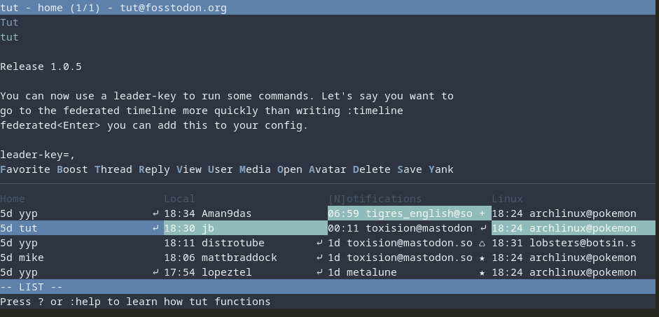

# Tut - a Mastodon TUI
[](https://github.com/RasmusLindroth/tut/releases)
[](https://tut.anv.nu)
[](https://aur.archlinux.org/packages/tut)
[](https://aur.archlinux.org/packages/tut-bin)
[](https://fosstodon.org/@tut)

A TUI for Mastodon with vim inspired keys. The program has most of the 
features you can find in the web client. 

Press `C` to create a new toot and `N` to focus on your notifications.

You can also enable [mouse support](#mouse-support).

You can find Linux binaries under [releases](https://github.com/RasmusLindroth/tut/releases).





## Table of contents
* [Currently supported commands](#currently-supported-commands)
* [Configuration](#configuration)
* [Install instructions](#install-instructions)
  * [Binary releases](#binary-releases)
  * [Arch and Manjaro](#arch-and-manjaro)
  * [Alpine Linux](#alpine-linux)
  * [Debian](#debian)
  * [FreeBSD](#freebsd)
  * [OpenBSD](#openbsd)
  * [NetBSD](#netbsd-and-others) and others
  * [Homebrew (macOS)](#homebrew-macos)
  * [openSUSE](#opensuse)
* [Build it yourself](#build-it-yourself)
* [Flags and commands](#flags-and-commands)
* [Templates](#templates)
* [Mouse support](#mouse-support)
* [Password manager for secrets](#password-manager-for-secrets)
* [Thanks to](#thanks-to)

## Currently supported commands
* `:quit` = Exit tut
* `:q` = Shorter form of former command
* `:timeline home|local|federated|direct|notifications|mentions|favorited|special-all|special-boosts|special-replies` = Open selected timeline
* `:tl h|l|f|d|n|m|fav|sa|sb|sr` = Shorter form of former command
* `:blocking` = Lists users that you have blocked
* `:boosts` = Lists users that have boosted the toot
* `:bookmarks` = List all your bookmarks
* `:clear-notifications` = Remove all of your notifications
* `:close-pane` = Closes the current pane, including all the timelines in said pane
* `:compose` = Compose a new toot
* `:edit` = Edit one of your toots
* `:favorited` = Lists toots  you&#39;ve favorited
* `:favorites` = Lists users that favorited the toot
* `:follow-tag <tag>` = Follow a hashtag named &lt;tag&gt;
* `:followers` = List of people the account are following. It only works on profiles
* `:following` = List of people follwing the account. It only works on profiles
* `:help` = Show help for how to use tut
* `:h` = Shorter form of former command
* `:history` = Show edits of a toot
* `:lists` = Show a list of your lists
* `:list-placement top|right|bottom|left` = Place the list in choosen placement
* `:list-split row|column` = Split the timelines by row or column
* `:login` = Login to one more account
* `:move-pane left|right|up|down|home|end` = Moves the pane in choosen direction
* `:mp l|r|u|d|h|e` = Shorter form of former command
* `:muting` = Lists users that you&#39;ve muted
* `:newer` = Force load newer toots in current timeline
* `:next-acct` = Go to the next account if you&#39;re logged in to multiple
* `:preferences` = Update your profile and some other settings
* `:prev-acct` = Go to the prev account if you&#39;re logged in to multiple
* `:profile` = Go to your profile
* `:proportions [int] [int]` = Sets the proportions of the panes and the content. The first integer is your panes and the other for content, e.g. :proportions 1 3
* `:refetch` = Refetches the current item that you&#39;re viewing. Can be used to update poll results.
* `:saved` = Alias for bookmarks
* `:stick-to-top` = Toggle the stick-to-top setting that always shows the latest toot in all timelines
* `:tag <tag>` = Shows toots tagged with &lt;tag&gt;, e.g. :tag linux. You can input multiple tags if you want to show them in the same timeline
* `:tags` = List of tags that you&#39;re following
* `:unfollow-tag <tag>` = Unfollow the hashtag named &lt;tag&gt;, e.g. :unfollow-tag tut
* `:user <username>` = Search for users named &lt;username&gt;, e.g. :user rasmus. To narrow a search include the instance like this :user rasmus@mastodon.acc.sunet.se
* `:pane <int>` = Switch pane by index (zero indexed) e.g. :pane 0 for the left/top pane

Keys without description in tut
* `c` = Compose a new toot
* `j` or `Down arrow` = Navigate down in feed list or toot
* `k` or `Up arrow` = Navigate up in feed list or toot
* `h` or `Left arrow` = Cycle back in open timelines
* `l` or `Right arrow` = Cycle forward in open timelines
* `g` or `Home` = Go to top in feed list or toot
* `G` or `End` = Go to bottom in feed list or toot
* `?` = View help
* `q` = Go back or quit
* `Esc` = Go back

Explanation of the non obvious keys when viewing a toot
* `v` = view. In this mode you can scroll throught the text of the toot if it doesn&#39;t fit the screen
* `o` = open. Gives you a list of all URLs in the toot. Opens them in your default browser, if it&#39;s an user or tag they will be opened in tut
* `m` = media. Opens the media with xdg-open

## Configuration
Tut is configurable, so you can change things like the colors, the default timeline, 
what image viewer to use and some more. Check out the configuration file to see 
all the options.

You find it in `XDG_CONFIG_HOME/tut/config.toml` on Linux which usually equals to `~/.config/tut/config.toml`.
If you don't run Linux it will use the path of [os#UserConfigDir](https://github.com/golang/go/blob/7dc9fcb13de7bb20b11f6a526865545cc9142c2c/src/os/file.go#L455-L461).
But if you move the tut folder to `XDG_CONFIG_HOME/tut/` and have set the environment variable `XDG_CONFIG_HOME`
it will look there instead of the standard place.

You can find an updated configuration file in this repo named `config.example.toml`.
If there are any new configurations options you can copy them frome that file.
If you prefer a website you can read about all the options on [tut.anv.nu](https://tut.anv.nu/config) and
if man pages are your thing use `tut(5)`.

## Install instructions
### Binary releases
Head over to https://github.com/RasmusLindroth/tut/releases

### Arch and Manjaro

You can find it in the Arch User Repository (AUR). I'm the maintainer there.

https://aur.archlinux.org/packages/tut/
https://aur.archlinux.org/packages/tut-bin/

You can also use `tut-mastodon`. Currently `aur/tut` collides with a package 
named `tut` if you're running Manjaro ARM. So if you face the same problem you 
can use this package instead. I suggest you add an alias for tut-mastodon to
tut in the config for your shell. Usually `.bashrc` or `.zshrc`.

`alias tut='tut-mastodon'`

https://aur.archlinux.org/packages/tut-mastodon/

### Alpine Linux

`tut` package is available in the community repository.

https://pkgs.alpinelinux.org/package/edge/community/x86_64/tut

### Debian

http://packages.azlux.fr/

### FreeBSD

https://www.freshports.org/net-im/tut 

### OpenBSD

https://openports.pl/path/net/tut

The `tut` is available since OpenBSD 7.3.  It can be installed with:

	pkg_add tut

### NetBSD (and others)

Available as [net/tut](https://pkgsrc.se/net/tut) in
[pkgsrc](https://pkgsrc.org), NetBSD's portable package manager.
Also for Linux, macOS, Illumos, etc. Install from the tree or with
pkgin:

```
pkgin install tut
```

### Homebrew (macOS)

Available as a Homebrew Formulae over [here](https://formulae.brew.sh/formula/tut).
Install it like this:

```
brew update
brew install tut
```

### openSUSE

`tut` package is shipped as part of openSUSE Tumbleweed and openSUSE Leap 15.5+. It can be installed via:

`sudo zypper in tut`

[suntorytimed](https://build.opensuse.org/users/suntorytimed) is the maintainer of the package.

## Build it yourself
If you don't use the binary that you find under releases
you will need Go. Use a newer one that supports modules.

```bash
# Fetches and installs tut. Usally /home/user/go/bin
go install github.com/RasmusLindroth/tut@latest

# You can also clone the repo if you like
# First clone this repository
git clone https://github.com/RasmusLindroth/tut.git

# Go to that folder
cd tut

# Build or install

# Install (usually /home/user/go/bin)
go install

# Build (same directory i.e. ./ )
go build
```

If you choose to install and want to be able to just run `tut` 
you will have to add `go/bin` to your `$PATH`.

## Flags and commands
```
Commands:
    example-config - creates the default configuration file in the current directory and names it ./config.example.toml

Flags:
	-h  --help             prints this message
	-v  --version          prints the version
	-n  --new-user         add one more user to tut
	-c  --config <path>    load config.toml from <path>
	-d --config-dir <path> load all config from <path>
	-u  --user <name>      login directly to user named <name>
      If you want to login to multiple accounts seperate them with a space and use quotation marks. E.g. -u "acc_one acc_two"
      If two users are named the same. Use full name like tut@fosstodon.org
```

If you don't want to set `--config` or `--config-dir` everytime you can set
the environment variables `TUT_CONF` and `TUT_CONF_DIR` instead.

## Templates
You can customise how toots and user profiles are displayed with a
Go [text/template](https://pkg.go.dev/text/template).

You'll have to place a file named `toot.tmpl` and/or `user.tmpl`
in `XDG_CONFIG_HOME/tut/` which usually equals to `~/.config/tut/`.

You can copy [./config/toot.tmpl](./config/toot.tmpl) and [./config/user.tmpl](./config/user.tmpl)
from this repo manually or with `curl` or `wget`.

```bash
cd ~/.config/tut

# using curl
curl -o toot.tmpl https://raw.githubusercontent.com/RasmusLindroth/tut/master/config/toot.tmpl

curl -o user.tmpl https://raw.githubusercontent.com/RasmusLindroth/tut/master/config/user.tmpl

# using wget
wget https://raw.githubusercontent.com/RasmusLindroth/tut/master/config/toot.tmpl

wget https://raw.githubusercontent.com/RasmusLindroth/tut/master/config/user.tmpl
```

The data available for you in `toot.tmpl` is two structs. The first one is the `Toot`-struct, you can see all fields in [./ui/item_status.go](./ui/item_status.go). The second one is the `Style`-struct. You can find the fields for style in [./config/config.go](./config/config.go).

You acces them with `.Toot` and `.Style` in your template file.

The data available in `user.tmpl` is almost the same. You still have the
`Style` but instead of `Toot` you have a struct named `User`. You can see
all fields in [./ui/item_user.go](./ui/item_user.go).

## Mouse support
To enable mouse support you'll have to set `mouse-support=true` under `[general]`
in your [config](#configuration).

## Password manager for secrets
If you run `pass`, `gopass` or  something similar you can protect your secrets.
You'll have to manually update your `accounts.toml`. It should be located at 
`~/.config/tut/accounts.toml`. Currently you can only hide `ClientID`, `ClientSecret` and `AccessToken`. The command **must** be prefixed with `!CMD!`. Here's an example 
of what the file can look like.

```bash
[[Accounts]]
Name = 'tut'
Server = 'https://fosstodon.org'
ClientID = '!CMD!gopass show -o -f misc/tut-id'
ClientSecret = '!CMD!gopass show -o -f misc/tut-secret'
AccessToken = '!CMD!gopass show -o -f misc/tut-token'
```

## Thanks to
* [mattn/go-mastodon](https://github.com/mattn/go-mastodon) - Mastodon API
* [rivo/tview](https://github.com/rivo/tview) - making the TUI
* [gdamore/tcell](https://github.com/gdamore/tcell) - used by tview under the hood
* [microcosm-cc/bluemonday](https://github.com/microcosm-cc/bluemonday) - used to remove HTML-tags
* [atotto/clipboard](https://github.com/atotto/clipboard) - yanking to clipboard
* [gen2brain/beeep](https://github.com/gen2brain/beeep) - notifications
* [gobwas/glob](https://github.com/gobwas/glob) - glob in patterns
* [pelletier/go-toml](https://github.com/pelletier/go-toml) - toml parser
* [go-ini/ini](https://github.com/go-ini/ini) - ini parser
* [icza/gox](https://github.com/icza/gox) - diff between two `time.Time`
